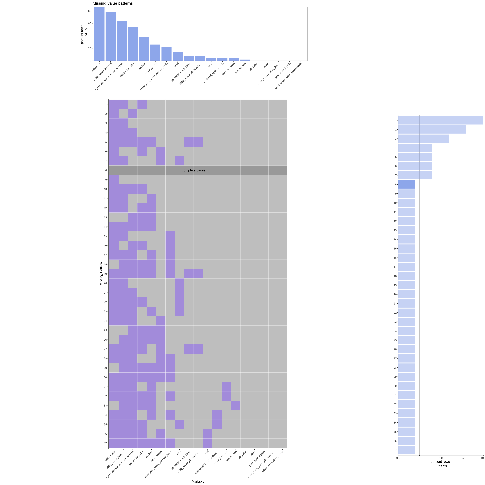

# Missing values

```{r, message = F, echo = F}
```

## EIA Data
### Missing State/Fuel Type Power Generation
The EIA.gov data set was one of the data set with missing values that we used in our analysis. Most of the missing values were absent because most states did not generate electricity for all fuel types. This missing data can show which fuel types are most widely adopted by all U.S. states and which fuel types are less common. For example, geothermal had the most missing values, so it was one of the least used fuels. 
```{r, echo = F,fig.width=12,fig.height=12}

```

```{r, message= FALSE, warning=FALSE}
library(tidyverse)
library(data.table)
library(d3r)
library(parcoords)
library(GGally)
library(janitor)
library(egg)
library(ggpubr)
library(kableExtra)
library(patchwork)
```

```{r, message= FALSE, warning=FALSE}
find_missing_patterns <- function(df, aggregation = 'count'){
  
  #find missing patterns
  missing_patterns <- data.frame(is.na(df)) %>%
  group_by_all() %>%
  count(name = "count", sort = TRUE) %>%
  ungroup()
    #create g1
  missing_patterns_sums <- df %>%
  summarise(across(everything(), ~ sum(is.na(.)))) %>% 
  pivot_longer(cols = names(df), names_to='name',values_to='value') %>%
  arrange(desc(value))
  
   if (aggregation=='percent'){
    total_sum<-length(row.names(df))
    missing_patterns_sums$value<- missing_patterns_sums$value*100/total_sum
    print(total_sum)
    y_label = 'percent rows \n missing'
   }
  else{
    y_label = 'num rows \n missing'
  }
  column_reorder <- missing_patterns_sums$name
  
  
  g1 <- ggplot(missing_patterns_sums, aes(x=fct_reorder(name, -value), y=value))+
    geom_bar(stat='identity', fill='#9eb7ee') +
    scale_y_continuous(limits=c(0, max(missing_patterns_sums$value)), expand=c(0,0)) +
    xlab('') +
    ylab(y_label) +
    ggtitle('Missing value patterns') +
    theme(panel.border = element_rect(colour = "black", fill=NA, size=.5), 
          panel.background = element_rect(fill = "white"),
          panel.grid.minor.x = element_blank(),
          panel.grid.minor.y = element_blank(),
          panel.grid.major.x = element_blank(),
          panel.grid.major.y = element_line(color='darkgray', size=.1)) +
    theme(axis.text.x = element_blank()) + #element_text(angle = 45, vjust = 1, hjust=1)) +
    theme(aspect.ratio = .25)
  
  #Create g3
  missing_patterns_count <- missing_patterns %>% mutate_all((as.integer)) %>% adorn_totals("col")
  missing_patterns_count$col <- as.factor(ifelse(missing_patterns_count$Total - missing_patterns_count$count == 0 , 1, 0.5))
  missing_patterns_count$id <- row.names(missing_patterns_count)
  
  if(aggregation=='percent'){
    missing_patterns_count$count<-missing_patterns_count$count*100/sum(missing_patterns_count$count)
    x_label = 'percent rows'
  }
  else{
    x_label = 'row count'
  }
  pattern_id <- missing_patterns_count  %>% filter(col == 1) %>% select(id) %>% as.character()
  missing_patterns_count$id <- factor(missing_patterns_count$id)
  missing_patterns_count$id <- fct_relevel(missing_patterns_count$id, paste(sort(as.integer(levels(missing_patterns_count$id)), decreasing = TRUE)))
  g3 <- missing_patterns_count %>%
    #rowid_to_column(var="pattern") %>%
    #mutate(pattern = factor(pattern)) %>%
    ggplot(aes(y=fct_reorder(id, -desc(count)), x=count)) + 
    geom_bar(stat='identity', fill='#9eb7ee',aes(alpha = factor(missing_patterns_count$col))) +
    scale_x_continuous(limits=c(0, max(missing_patterns_count$count)), expand=c(0,0)) + #, breaks = seq(0,max(missing_patterns$count), 5) if want to have the y axis break on 5s
    ylab('') +
    xlab(y_label) +
    theme(panel.border = element_rect(colour = "black", fill=NA, size=.5), 
          panel.background = element_rect(fill = "white"),
          panel.grid.minor.x = element_blank(),
          panel.grid.minor.y = element_blank(),
          panel.grid.major.y = element_blank(),
          panel.grid.major.x = element_line(color='darkgray', size=.1),) +
    scale_alpha_manual(values=c("0.5"=0.5,"1"=1),guide="none") +
    theme(aspect.ratio = 4)
  
  #create g2
  main_plot_df <- missing_patterns %>%
  select(-c(count)) %>%
  as_tibble() %>%
  rowid_to_column(var="Y") %>%
  gather(key="X", value="Z", -1) 

  main_plot_df$X <- as.factor(main_plot_df$X)
  main_plot_df$Y <- as.factor(main_plot_df$Y)
  main_plot_df$X <- fct_relevel(main_plot_df$X, column_reorder)
  main_plot_df$Y <- fct_relevel(main_plot_df$Y, rev(levels(main_plot_df$Y)))
  
  
  main_plot_df$Z <- as.factor(ifelse(main_plot_df$Y == pattern_id, .5, main_plot_df$Z))
  
  
  temp1 <- names(df)[2:length(names(df))]
  temp1 <- append(temp1,"Series")
  
  g2 <- ggplot(main_plot_df, aes(X, Y, fill= Z)) + 
      geom_tile(color='white') +
      theme(legend.position="none") +
    scale_fill_manual(values=c('#cacaca', 'darkgray', '#b2a0e1')) +
    annotate("text",x=length(unique(main_plot_df$X))/2,y=length(unique(main_plot_df$Y))-as.integer(pattern_id)+1,label='complete cases') + 
    xlab('Variable') +
    ylab('Missing Pattern') +
    #scale_x_discrete(limits=temp1) +
    theme_classic() +
    theme(legend.position = "none") +
    theme(axis.text.x = element_text(angle = 45, vjust =1, hjust=1)) +
    coord_equal() + theme(aspect.ratio = length(row.names(missing_patterns))/(length(names(missing_patterns))-1))
  
  #Arrange graphs
  blank <- ggplot() + 
              geom_point(aes(1,1), colour="white") +
              theme(                              
                plot.background = element_blank(), 
                panel.grid.major = element_blank(), 
                panel.grid.minor = element_blank(), 
                panel.border = element_blank(), 
                panel.background = element_blank(),
                axis.title.x = element_blank(),
                axis.title.y = element_blank(),
                axis.text.x = element_blank(),
                axis.text.y = element_blank(),
                axis.ticks = element_blank()
              )

  #p = ggarrange(g1,blank,g2,g3,ncol=2,nrow=2,widths = c(16,4),heights=c(4,16))
  p = g1+plot_spacer()+g2+g3+plot_layout(ncol=2,nrow=2,widths=c(8,1),heights=c(1,1))
  return(p)
}
```

```{r, message = FALSE, include = FALSE}
#https://www.eia.gov/electricity/data/browser/#/topic/0?freq=M&start=200101&end=202108&ctype=linechart&ltype=pin&pin=&maptype=0
df <- read.csv('data/raw/clean_monthly_fuel_generation.csv')
df$fuel <- trimws(df$fuel) 
df$date <- as.Date(df$date)
df[is.na(df$thousand_megawatthours),]$thousand_megawatthours <- 0
df$fuel <- gsub(" ", "_", df$fuel)
df$fuel <- gsub("-", "_", df$fuel)
```

```{r, message = FALSE, warning = FALSE}
state_fuel <- df %>% group_by(state, fuel) %>% summarize(total_thousand_mwh = sum(thousand_megawatthours)) %>% pivot_wider(id_cols = c(state), names_from= fuel, values_from = total_thousand_mwh)
#test2
state_fuel_graph <- state_fuel
state_fuel_graph$state <- NULL
p = find_missing_patterns(state_fuel_graph, 'count')
#ggsave('state-fuel type-missing patterns.png', height = 10, width = 10, units = "in")
```
From the table above, it is seen that all states use solar energy at some point. An interesting observation is that there are some states that did not use coal at any point during this time period. Taking a closer look, using the table below, it is seen that Vermont and Rhode Island are the two states that did not use coal as an energy generation source. This table also shows that California was the only state to use all fuel types.
```{r}
state_fuel %>% arrange(!is.na(coal), coal) %>% mutate_all(~cell_spec(.x, color = ifelse(is.na(.x), "red"," black"))) %>% kable(escape = F) %>% kable_styling("striped", font_size = 9, full_width = F) %>% 
 scroll_box(width = "800px", height = "300px")
```

The plot below shows the time series of different types of solar energy production. From the plot it can be noticed that the total solar value, which is the aggregation of the utility scale solar and small scale photovoltaics fuels, is missing data for dates before 2014. It seems that the aggregation did not include the utility scale solar values before that time; perhaps the aggregation had an error because there were n/a's in the data for small scale solar photovoltaic during this time period.

```{r, echo = F, warning=F, fig.width = 10}
#df <- read.csv('data/clean/clean_monthly_fuel_generation.csv')
# df$fuel <- trimws(df$fuel) 
# df$date <- as.Date(df$date)
# df[is.na(df$thousand_megawatthours),]$thousand_megawatthours <- 0
# df$fuel <- gsub(" ", "_", df$fuel)
# df$fuel <- gsub("-", "_", df$fuel)

solar_missing <- df  %>% 
  group_by(fuel, date) %>% summarise(mil_mwhrs = sum(thousand_megawatthours)/1000) %>% filter(fuel %in% c('all_solar', 'all_utility_scale_solar', 'small_scale_solar_photovoltaic')) 
solar_missing$fuel[solar_missing$fuel == "all_solar"] <- 'Total'
solar_missing$fuel[solar_missing$fuel == "all_utility_scale_solar"] <- 'Utility_Scale'
solar_missing$fuel[solar_missing$fuel == "small_scale_solar_photovoltaic"] <- 'Small_Scale_PV'
solar_missing$fuel <- as.factor(solar_missing$fuel)
solar_missing$fuel <- fct_relevel(solar_missing$fuel, c('Total','Utility_Scale', 'Small_Scale_PV'))

solar_missing %>%  ggplot(aes(x = date, y = mil_mwhrs, color = fuel)) +
  geom_line() +
  ggtitle("Solar Energy Generation") +
  xlab("Date") +
  ylab("MW Hours (Mil)") +
  annotate(
    geom = "curve", x = as.Date('2011-01-01'), y = 5, xend = as.Date('2014-01-01'), yend = 1.37, 
    curvature = 0, arrow = arrow(length = unit(2, "mm"))
  ) +
  annotate(geom = "text", x = as.Date('2009-01-01'), y = 6, label = "Total solar data\n starts in 2014", hjust = "left") +
  annotate(
    geom = "curve", x = as.Date('2004-01-01'), y = 10, xend = as.Date('2001-01-01'), yend = 0, 
    curvature = 0, arrow = arrow(length = unit(2, "mm"))
  ) +
  annotate(geom = "text", x = as.Date('2002-01-01'), y = 11, label = "Utility scale solar data\n starts in 2001", hjust = "left") +
  theme_classic(12) +
  theme(plot.title = element_text(hjust = .5))

```

## WB Data
### Missing values analysis of the WB data

We examined missing data in the WB data set  from two perspectives - by development indicators (row) and years (column). We observed that 4 indicators (Pov Rt, Ext Debt, Debt Sv %, and ODA) are completely missing in the dataset. Additionally the earlier years (1960 - 1969) have 29-36 missing indicators with the exception of the last year's (2020) data. It is possible that 2020 data is not available because of a time lag in publishing data for such development indicators. The tables of top 15 missing values by rows/columns are listed below:

```{r, message = FALSE, warning = FALSE}

library(tidyverse)

#Get Wb data & process it for analysis
us_wb_df_r <- as.data.frame(read_csv('data/raw/clean_worldbank.csv'))

us_wb_df <- as.data.frame(read_csv('data/raw/clean_worldbank.csv'))
row.names(us_wb_df)<-us_wb_df[,"Series"]
us_wb_df <-us_wb_df[,2:length(names(us_wb_df))]

#Apply short names
rownames(us_wb_df) <- c('Pop T', 'Pop G', 'Area', 'Pov Rt', 'GNI T','GNI Pc', 'GNI PPP', 'GNI PPP Pc', 'Inc Shr', 'Life Exp', 'Fertility Rt', 'Ado Ft', 'Contr Pr', 'Birth Rt', 'Mort Rt', 'Under Wt', 'Imm Mea', 'Prim Comp', 'Sec Sch', 'Prim Sch', 'HIV', 'Forest A', 'Water P', 'Energy Use', 'C02 Em', 'Elec Pwr', 'GDP T', 'GDP %', 'Infl %', 'Agri %', 'Industry %', 'Exports %', 'Imports %', 'Gross %', 'Revenue, %', 'Start up', 'Mkt Cap %', 'Military %', 'Mobile Sub', 'HT Exp %', 'Merchandise %', 'Net Bart', 'Ext Debt', 'Debt Sv %', 'Migration', 'Remittance', 'FDI', 'ODA')


#matrix for missing data analysis
my_us_wb_m <- t(us_wb_df)
my_us_wb_df_p <- as.data.frame(t(us_wb_df))

#Missing value by column
missing_column_values <- as.matrix(colSums(is.na(my_us_wb_m)) %>%
           sort(decreasing = TRUE))
print(missing_column_values[ 1:15, ])


#Missing value by row
missing_row_values <- as.matrix(rowSums(is.na(my_us_wb_m)) %>%
                                  sort(decreasing = TRUE))
print(missing_row_values[1:15, ])


```
We further analyzed the missing value patterns in the development indicators using the mi:missing_data function which excluded the 4 indicators (listed above) that are completely missing from the WB data set. The heatmap of missing values analysis by data fields provided us with the missing value patterns for example GNI PPP and GNI PC PPP are both missing on same years (pre-1990). It also confirmed that the indicators that are required for our data analysis such as CO2 Emis PC, GNI PC, Energy Use PC, GDP %, and Power Cons PC are largely present in the historical data set to explore important trends for U.S. clean energy industry. 
```{r, message = FALSE, warning = FALSE}
library(mi)
x <- mi::missing_data.frame(my_us_wb_m)
image(x, grayscale = FALSE, col=hcl.colors(12, "YlOrRd", rev = FALSE))
```
